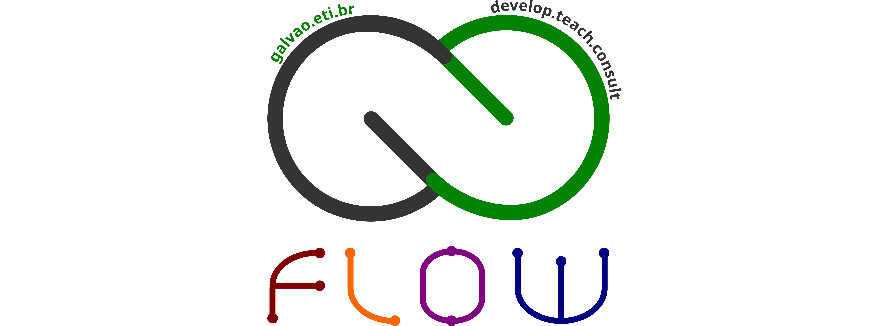
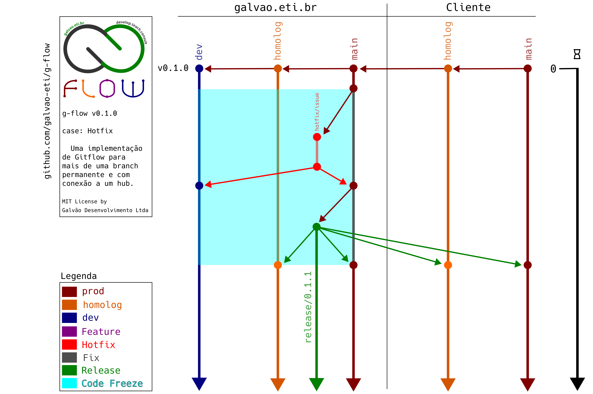
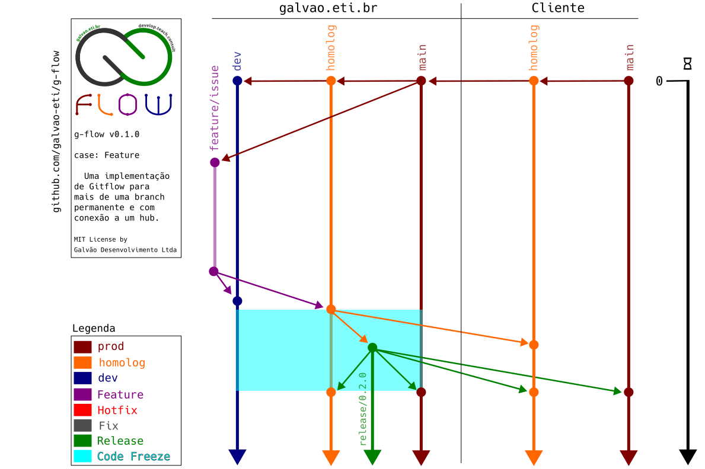
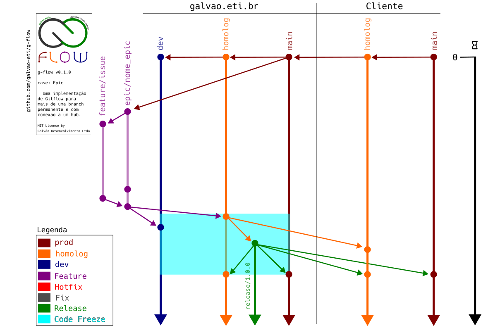
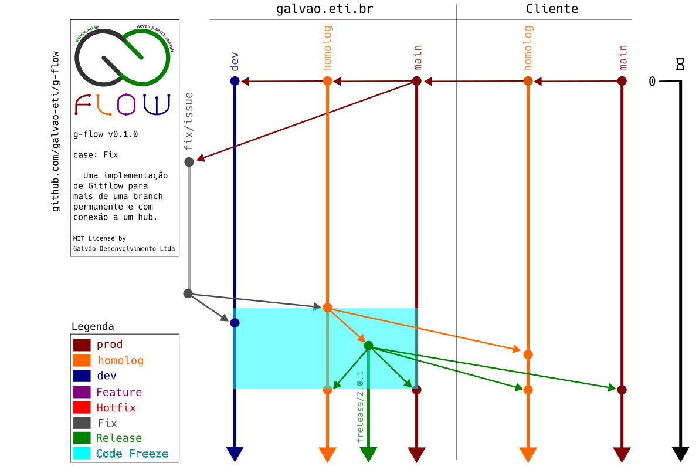

# g-flow


## Intro

[Gitflow](https://nvie.com/posts/a-successful-git-branching-model/) é uma estratégia de branching muito conhecida e largamente adotada pelo mercado. 

Existem, porém, alguns problemas:

1. As ferramentas desenvolvidas pelo próprio criador, não apenas parecem abandonadas, mas não levam em consideração um hub (Github, Gitlab, Bitbucket, etc...) o que gerou uma miríade de forks, que por sua vez têm os seus problemas;
1. A estratégia em si e por consequência as ferramentas consideram apenas uma branch permanente, o que não apenas não condiz com a realidade de muitos repositórios, mas pode melhorar (mais sobre isso abaixo).

### Estratégia de Branching
Conforme já mencionado a g-flow é uma estratégia baseada na [Gitflow](https://nvie.com/posts/a-successful-git-branching-model/), demonstrada nos conceitos e diagramas abaixo.

Questões importantes a serem consideradas:

1. Apenas estas branches são permanentes: Desenvolvimento (dev), Homologação (homolog), Produção (main) e branches de Release;
1. As branches temporárias são excluídas após o lançamento de Release que as contém;
1. Todas as branches de trabalho partem sempre de Produção;
1. A branch de Produção recebe atualizações apenas de Hotfixes e Releases;
1. Releases são sempre lançadas em Produção e Homologação.

### Conceitos

1. Desenvolvimento é a branch Bleeding Edge, onde todas as issues são mergeadas quando aprovadas.
1. Homologação é a branch de Pré-Release e pode temporariamente sair de sincronia com as demais dependendo do processo de Homologação.
1. Branches de Release são propositalmente permanentes para que seja possível a rápida troca de versões para inspeção, comparações, etc...
1. Na concepção do projeto (tempo === 0), as branches iniciais (Desenvolvimento, Homologação e Produção) são exatamente iguais e, em caso de um sistema existente, um espelho da branch de Produção do Cliente;
1. Code Freeze é o período de tempo onde é absolutamente proibido realizar merges em qualquer branch.

### Fluxos de Exemplo:
#### Fluxo 0: Hotfix

1. Após a identificação do bug o(a) Release Manager (RM) declara o início do Code Freeze.
1. Dev cria a branch com o nome no formato hotfix/issue a partir de Produção e imediatamente a cria remotamente, p.ex.:  
  
 ```bash
 git checkout -b hotfix/1903 main
 git push -u origin hotfix/1903
 ```
3. Dev trabalha na sua branch, testa a correção localmente, faz o push para a sua branch remota e notifica o(a) RM:

```bash
 git add arquivos_modificados
 git commit -m "Mensagem de Commit"
 git push
 ```
4. O(a) RM faz o merge em Produção e Desenvolvimento.
4. Estando declarada a solução do bug, o(a) RM lança a release a partir de Produção e faz o merge para todas as branches de Homologação e Produção.
4. O período de Code Freeze é encerrado.

#### Fluxo 1: Feature

1. Dev cria a branch com o nome no formato feature/issue a partir de Produção e imediatamente a cria remotamente, p.ex.:    
  
 ```bash
 git checkout -b feature/1901 main
 git push -u origin feature/1901
 ```
  2. Dev trabalha na sua branch, testa a feature localmente e faz pushes para a sua branch remota.
```bash
 git add arquivos_modificados
 git commit -m "Mensagem de Commit"
 git push
 ```
3. Ao concluir o trabalho, Dev abre uma PR para Desenvolvimento.
3. É realizado o Code Review.
3. Se a PR for aprovada, o(a) RM faz o merge para Desenvolvimento e Homologação e declara o início do Code Freeze.
3. Em Homologação são realizados os testes de Regra de Negócio. Caso o trabalho seja homologado, ele é mergeado no ambiente de Homologação do Cliente.
3. O Cliente então faz os seus testes para que a alteração seja homologada.
3. Se o cliente homologar, o(a) RM lança a release a partir de Homologação e faz o merge para todas as branches de Homologação e Produção.
3. O período de Code Freeze é encerrado.
#### Fluxo 2: Epic Feature

1. É criada uma branch com o nome no formato feature/nome_da_epic a partir de Produção.
1. Devs criam branches de features com o nome no formato feature/issue a partir de feature/nome_da_epic e imediatamente a criam remotamente, p.ex.:  
  
 ```bash
 git checkout -b feature/1902 feature/epic
 git push -u origin feature/1902
 ```
  3. Devs trabalham nas suas branches, testam a feature localmente e fazem pushes para a sua branch remota.
 ```bash
 git add arquivos_modificados
 git commit -m "Mensagem de Commit"
 git push
 ```
4. Ao concluir o trabalho, Dev abre uma PR para Desenvolvimento.
4. É realizado o Code Review.
4. Se a PR for aprovada, o(a) RM faz o merge para Desenvolvimento e Homologação e declara o início do Code Freeze.
4. Em Homologação são realizados os testes de Regra de Negócio. Caso o trabalho seja homologado, ele é mergeado no ambiente de Homologação do Cliente.
4. O Cliente então faz os seus testes para que a alteração seja homologada.
4. Se o cliente homologar, o(a) RM lança a release a partir de Homologação e faz o merge para todas as branches de Homologação e Produção.
4. O período de Code Freeze é encerrado.
#### Fluxo 3: Fix

1. Dev cria a branch com o nome no formato fix/issue a partir de Produção e imediatamente a cria remotamente, p.ex.:  

 ```bash
 git checkout -b fix/1904 main
 git push -u origin fix/1904
 ```
2. Dev trabalha na sua branch, testa a correção localmente e faz pushes para a sua branch remota.
 ```bash
 git add arquivos_modificados
 git commit -m "Mensagem de Commit"
 git push
 ```
3. Ao concluir o trabalho, Dev abre uma PR para Desenvolvimento.
4. É realizado o Code Review.
5. Se a PR for aprovada, o(a) RM faz o merge para Desenvolvimento e Homologação e declara o início do Code Freeze.
6. Em Homologação são realizados os testes de Regra de Negócio. Caso o trabalho seja homologado, ele é mergeado no ambiente de Homologação do Cliente.
7. O Cliente então faz os seus testes para que a alteração seja homologada.
8. Se o cliente homologar, o(a) RM lança a release a partir de Homologação e faz o merge para todas as branches de Homologação e Produção.
9. O período de Code Freeze é encerrado.
