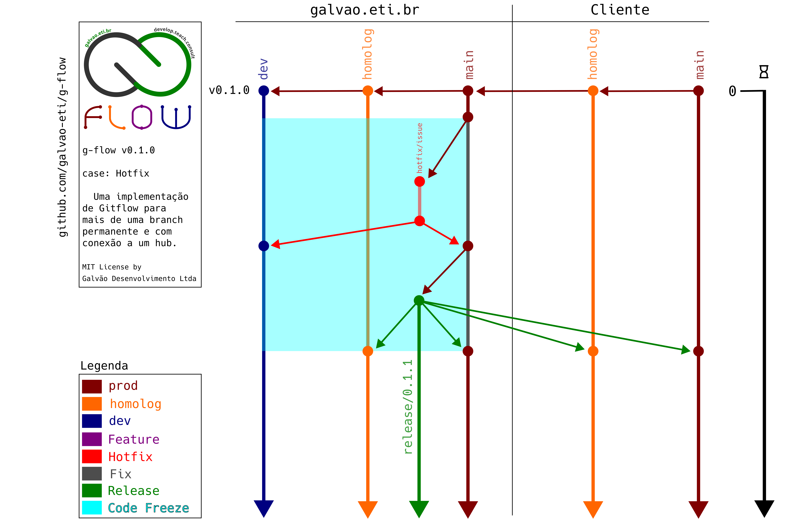

# g-flow


[ [Intro](#intro) ] [ [Ferramenta](#ferramenta) ] [ [Estratégia de Branching](#estratégia-de-branching) ] [ [Fluxos de Exemplo](#fluxos-de-exemplo) ] [ [FAQ](#faq) ]

## Intro
g-flow é uma implementação Gitflow completa e prática.

[Gitflow](https://nvie.com/posts/a-successful-git-branching-model/) é uma estratégia de branching muito conhecida e largamente adotada pelo mercado. 

Existem, porém, alguns problemas:

1. As ferramentas desenvolvidas pelo próprio criador, não apenas parecem abandonadas, mas não levam em consideração um hub (Github, Gitlab, Bitbucket, etc...) o que gerou uma miríade de forks, que por sua vez têm os seus problemas;
1. A estratégia em si e por consequência as ferramentas consideram apenas duas branches permanentes, o que não apenas não condiz com a realidade de muitos repositórios, mas pode melhorar (mais sobre isso abaixo).

### Estratégia de Branching
Conforme já mencionado a g-flow é uma estratégia baseada na [Gitflow](https://nvie.com/posts/a-successful-git-branching-model/), demonstrada nos conceitos e diagramas abaixo.

Questões importantes a serem consideradas:

1. Apenas estas branches são permanentes: Desenvolvimento (dev), Homologação (homolog), Produção (main) e branches de Release;
1. As branches temporárias são excluídas após o lançamento de Release que as contém;
1. Todas as branches de trabalho partem sempre de Produção;
1. A branch de Produção recebe atualizações apenas de Hotfixes e Releases;
1. Releases são sempre lançadas em Produção e Homologação.

### Conceitos

1. Desenvolvimento é a branch Bleeding Edge, onde todas as issues são mergeadas quando aprovadas.
1. Homologação é a branch de Pré-Release e pode temporariamente sair de sincronia com as demais dependendo do processo de Homologação.
1. Branches de Release são propositalmente permanentes para que seja possível a rápida troca de versões para regressão, inspeção, comparações, etc...
1. Na concepção do projeto (tempo === 0), as branches iniciais (Desenvolvimento, Homologação e Produção) são exatamente iguais e, em caso de um sistema existente, um espelho da branch de Produção do Cliente;
1. Code Freeze é o período de tempo onde é absolutamente proibido realizar merges em qualquer branch.

### Ferramenta

#### Importante

1. Como qualquer software livre, a ferramenta `g-flow.sh` é fornecida sem garantias (veja o arquivo da [Licença](/LICENSE));
1. Por favor observe que a ferramenta **sempre** fará:
* Um checkout de produção e um pull para garantir que sua cópia de produção esteja sincroizada;
* O push imediato da branch criada para o remote.
3. Embora eu não seja um ignorante no assunto eu não sou, por nenhum esforço de imaginação, um programador bash, portanto muitas coisas na ferramenta provavelmente podem ser melhoradas. Em breve vou publicar as guidelines para contribuir com o projeto.
1. No momento a ferramenta foi testada apenas com Linux (Fedora, mas deve funcionar em qualquer distribuição que possua uma versão mdoerna de bash rodando). Testes em outras distribuições Linux e outros Sistemas Operacionais são **muito bem-vindas**, mas não posso garantir implementações para outros SOs.

#### Instalação

Apenas clone esse repositório ou faça o download da [release mais recente](https://github.com/galvao-eti/g-flow/releases).

Alternativamente (recomendado) crie um link simbólico para a ferramenta:

```bash
sudo ln -s caminho_para_o_clone/bin/g-flow.sh /usr/local/bin/g-flow
```

#### Uso

Simplesmente rode a ferramenta sem nenhum argumento para exibir a ajuda:

```bash
g-flow
```

#### Configuração

A ferramenta roda com uma configuração default, presente no arquivo [.g-flowrc.dist](/.g-flowrc.dist).

Para alterar qualquer configuração copie esse arquivo como `.g-flowrc` na raiz do seu projeto. O arquivo é sempre válido apenas para o projeto em si.

Não use aspas em nenum dos valores de configuração e não use caracteres que não sejam letras, números, hífen ( - ) e sublinhado ( _ ).

### Fluxos de Exemplo:

O diagrama estático pode ser confuso dependendo do seu nível de familiaridade com git, branches, etc... Para um acompanhamento passo-a-passo, consulte [os slides](media/presentation/g-flow.pdf).

#### Fluxo 0: Hotfix

1. Após a identificação do bug o(a) Release Manager (RM) declara o início do Code Freeze.
1. Dev cria a branch com o nome no formato hotfix/issue a partir de Produção e imediatamente a cria remotamente, p.ex.:  

Com a ferramenta `g-flow.sh`:

 ```bash
 g-flow hfix 1903
 ```
  
Sem a ferramenta `g-flow.sh`:

 ```bash
 git checkout -b hotfix/1903 main
 git push -u origin hotfix/1903
 ```
3. Dev trabalha na sua branch, testa a correção localmente, faz o push para a sua branch remota e notifica o(a) RM:

```bash
 git add arquivos_modificados
 git commit -m "Mensagem de Commit"
 git push
 ```
4. O(a) RM faz o merge em Produção e Desenvolvimento.
4. Estando declarada a solução do bug, o(a) RM lança a release a partir de Produção e faz o merge para todas as branches de Homologação e Produção.
4. O período de Code Freeze é encerrado.

#### Fluxo 1: Feature

1. Dev cria a branch com o nome no formato feature/issue a partir de Produção e imediatamente a cria remotamente, p.ex.:    
 
Com a ferramenta `g-flow.sh`:

 ```bash
 g-flow feat 1901
 ```
  
Sem a ferramenta `g-flow.sh`:

 ```bash
 git checkout -b feature/1901 main
 git push -u origin feature/1901
 ```
  2. Dev trabalha na sua branch, testa a feature localmente e faz pushes para a sua branch remota.
```bash
 git add arquivos_modificados
 git commit -m "Mensagem de Commit"
 git push
 ```
3. Ao concluir o trabalho, Dev abre uma PR para Desenvolvimento.
3. É realizado o Code Review.
3. Se a PR for aprovada, o(a) RM faz o merge para Desenvolvimento e Homologação e declara o início do Code Freeze.
3. Em Homologação são realizados os testes de Regra de Negócio. Caso o trabalho seja homologado, ele é mergeado no ambiente de Homologação do Cliente.
3. O Cliente então faz os seus testes para que a alteração seja homologada.
3. Se o cliente homologar, o(a) RM lança a release a partir de Homologação e faz o merge para todas as branches de Homologação e Produção.
3. O período de Code Freeze é encerrado.
#### Fluxo 2: Epic Feature

1. É criada uma branch com o nome no formato epic/nome_epic a partir de Produção.
1. Devs criam branches de features com o nome no formato feature/issue a partir de epic/nome_epic e imediatamente a criam remotamente, p.ex.:  

Com a ferramenta `g-flow.sh`:

 ```bash
 g-flow feat 1902 epic/nome_epic
 ```
Sem a ferramenta `g-flow.sh`:
 
 ```bash
 git checkout -b feature/1902 epic/nome_epic
 git push -u origin feature/1902
 ```
  3. Devs trabalham nas suas branches, testam a feature localmente e fazem pushes para a sua branch remota.
 ```bash
 git add arquivos_modificados
 git commit -m "Mensagem de Commit"
 git push
 ```
4. Ao concluir o trabalho, Dev abre uma PR para a branch da epic.
4. É realizado o Code Review.
4. Se a PR for aprovada, o(a) RM faz o merge para a branch da epic.
4. Quando a epic estiver concluída e testada, Dev abre uma PR para Desenvolvimento.
4. Se a PR for aprovada, o(a) RM faz o merge para Desenvolvimento e Homologação e declara o início do Code Freeze.
4. Em Homologação são realizados os testes de Regra de Negócio. Caso o trabalho seja homologado, ele é mergeado no ambiente de Homologação do Cliente.
4. O Cliente então faz os seus testes para que a alteração seja homologada.
4. Se o cliente homologar, o(a) RM lança a release a partir de Homologação e faz o merge para todas as branches de Homologação e Produção.
4. O período de Code Freeze é encerrado.
#### Fluxo 3: Fix

1. Dev cria a branch com o nome no formato fix/issue a partir de Produção e imediatamente a cria remotamente, p.ex.:  

Com a ferramenta `g-flow.sh`:

 ```bash
 g-flow fix 1904
 ```
Sem a ferramenta `g-flow.sh`:
 
 ```bash
 git checkout -b fix/1904 main
 git push -u origin fix/1904
 ```
2. Dev trabalha na sua branch, testa a correção localmente e faz pushes para a sua branch remota.
 ```bash
 git add arquivos_modificados
 git commit -m "Mensagem de Commit"
 git push
 ```
3. Ao concluir o trabalho, Dev abre uma PR para Desenvolvimento.
4. É realizado o Code Review.
5. Se a PR for aprovada, o(a) RM faz o merge para Desenvolvimento e Homologação e declara o início do Code Freeze.
6. Em Homologação são realizados os testes de Regra de Negócio. Caso o trabalho seja homologado, ele é mergeado no ambiente de Homologação do Cliente.
7. O Cliente então faz os seus testes para que a alteração seja homologada.
8. Se o cliente homologar, o(a) RM lança a release a partir de Homologação e faz o merge para todas as branches de Homologação e Produção.
9. O período de Code Freeze é encerrado.

## FAQ

<details>
<summary>1. Por que existem tantos tipos diferentes de branches?</summary>
Para possibilitar métricas (quantidade de fixes, features, etc... por release).
</details>
<details>
<summary>2. Qual a diferença entre Hotfix e Fix?</summary>
A diferença é procedural. O Hotfix é um bug crítico que se encontra em produção e portanto deve ser corrigido rapidamente, ignorando passos de um Fix "normal" (Code Review, Origem de Release, etc...).
</details>
<details>
<summary>3. Porque a branch de Homologação recebe release se a release normalmente parte dela (mesmo caso com hotfixes e a branch de Produção)?</summary>
Para manter as branches de Homologação e Produção absolutamente sincronizadas, incluindo releases e versionamento.
</details>
<details>
<summary>4. Versionamento?</summary>
Sim. g-flow é alinhado com a prática de [Versionamento Semântico](https://semver.org/). A ferramenta incluirá um script de "bump" de versão.
</details>
<details>